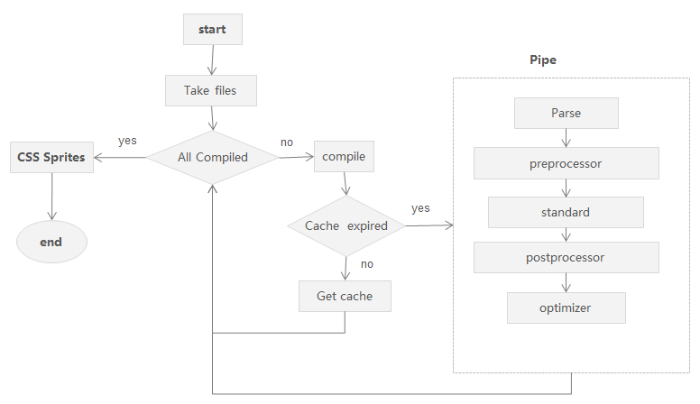

##A Toolset For Production

FIS automation tool is not just a task runner, more precisely speaking, it is a toolset for porduction. You can start working quickly without configuring a lot of independent tasks. The plugins system simply takes files, processes them, and pipes them to the next step. If you need to do something different, it’s rather simple: the fis config is simply a JavaScript file, so you can pull in existing node modules, run them, and be on your way.

###Pareser

- less
- bdtmpl
- po

###Preprocessor

- extlang

###Standard

- processing of embedded static resources
- replacing the path
- md5 timestamp
- dependces

###Postprocessor

- require-async
- jswrapper

###Optimizer

- uglify-js
- clean-css
- html-compress
- png-compressor
- smarty-xss

###CSS Sprites
