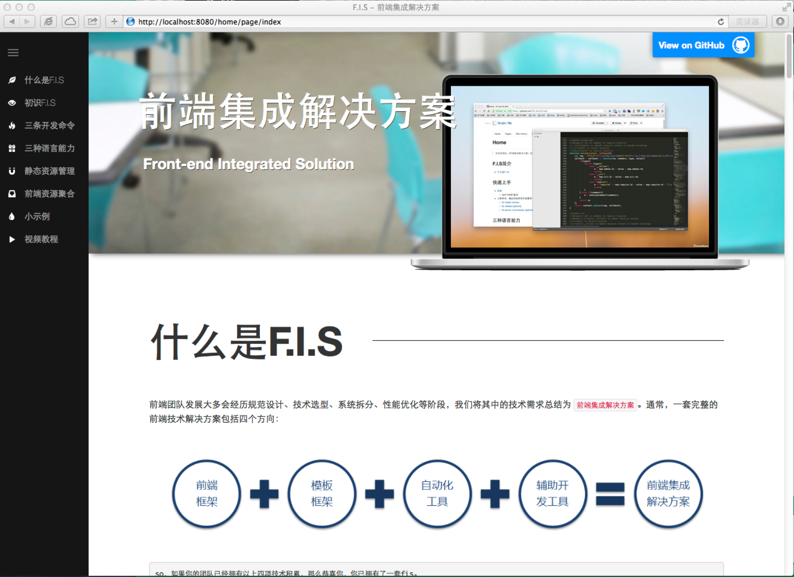

## get started

* We provide a small demo for you to exprience how to use fis.
* make sure you have installed nodejs, java, php, php-cgi, fis-plus and lights

### install lights 

how to install lights, it's easy

```bash
$npm install lights -g
```

lights officila site: http://lightjs.duapp.com

### Initiate local environment

Initiate fis local environment and use lights to install demo to your machine

```bash
$ fisp server init
$ lights install pc-demo
```

*  fis local environment includes Samrty3, fis-data, fis-rewrite, index.php

### preview demo

let's release the demo and launch FIS server to preview the page

```bash
$ cd common
$ fisp release -c

$ cd ../home
$ fisp release -c

$ fisp server start

//open your internet explorer
http://localhost:8080/home/page/index
```

you should see this page


you can try to edit the demo's content and release them again to see your changes.

### At last

* Congratulations, you have your first FIS project, you can continue to see [the command line](./command-line.md), [devlop and debug](./develop and debug.md), [release and deploy](./release and deploy.md), [monitor and optimize](./monitor and optimize.md).
* You will see more fantastic and powerful FIS functions afterwards~
