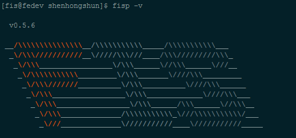

##Installation and Download

###General Installation Considerations

Before starting the installation, first you need to know what do you want to use FIS for. FIS contains tools(automation tool, front end package management tool), framework(module loader, smarty plugins, etc), development environment(server,back end environmental requirements).

###Automation tool

Performing repetitive tasks like compilation, minification, adding md5 timestamp, linting, etc. FIS automation tool depends on [Node](http://nodejs.org/) and [npm](https://www.npmjs.org/). You need to install nodeJS first:

####[install nodejs](http://nodejs.org/)

Then you can install fis via npm:

```
npm install fisp -g
```

check the fisp version

```
fisp -v
```



###Front end package management tool(referred to as lights)

Make it exceedingly simple to find, install and keep packages up-to-date. Lights depends on [Node](http://nodejs.org/) and [npm](https://www.npmjs.org/). You can install lights client via npm:

```bash
$npm install lights -g
```

lights officila site: http://lightjs.duapp.com

###High-performance module development framework

Includes front-end module loader, back-end smarty plugins, etc. It can efficiently control the loading of static resources. There are alse other back-end solutions coming soon. We can install them via lights:

```bash
//download front-end module loader
$lights install modjs
//download back-end smarty plugins
$ligths install pc-plugin
```

###Development environment

In case of setting up the server and php on your own computer, you need [Java](http://java.com/en/) and [php](http://cn2.php.net/downloads.php). After install Java and php, you can init you fis development enviroment:

```
$ fisp server init

```
