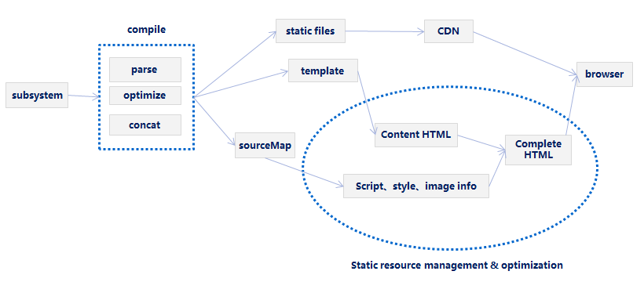

###Concat Files And Manage Dependencies Automatically

As many websites started growing, the old way of managing the CSS & JS files needed to be changed because of following reasons:

- Management nightmare, it was difficult to manage all the CSS & JS files in various web pages as it was required to include right files in right web pages in right order. The error started to get in, in form of many unneeded resource files found in one or more web pages.
- Performance issue, the performance issue was related with large number of HTTP requests that was required to be made for every CSS & JS files.

The CSS & JS files started getting managed by concat-sourcemap.It is used to scan the directories, read the fis-config.js file for configuration, concatenate files, gather the dependencies and update a map of static resources for the given webpage. This solved the issue of manual. Following represents sample code on how concat-sourcemap use to manage the dependencies and bundle them in form of updating the map with the bundled data.

###Concat-Sourcemap

Concatenate files and generate Sourcemap.

```javascript
//fis-conf.js
fis.config.merge({
    pack : {
        //pack all demo.js, script.js
        //The contents of the output is static / pkg / aio.js file
        'pkg/aio.js' : ['**/demo.js', /\/script\.js$/i],
        //package all the css files
        //The contents of the output is static/pkg/aio.css file
        'pkg/aio.css' : '**.css'
    }
});
```

Use fis release with `` -- pack `` parameter

```bash
$ fisp release --pack --dest ../output
``` 

In this example, it will concatenate the specified source files(in order), joining files with default separator and writing the output to dest/map.json.

```
    {
        "res": {
            "demo.css": {
                "uri": "/static/css/demo_7defa41.css",
                "type": "css",
                "pkg": "p1"
            },
            "demo.js": {
                "uri": "/static/js/demo_33c5143.js",
                "type": "js",
                "deps": [
                    "demo.css"
                ],
                "pkg": "p0"
            },
            "index.html": {
                "uri": "/index.html",
                "type": "html",
                "deps": [
                    "demo.js",
                    "demo.css"
                ]
            },
            "script.js": {
                "uri": "/static/js/script_32300bf.js",
                "type": "js",
                "pkg": "p0"
            },
            "style.css": {
                "uri": "/static/css/style_837b297.css",
                "type": "css",
                "pkg": "p1"
            }
        },
        "pkg": {
            "p0": {
                "uri": "/static/pkg/aio_5bb04ef.js",
                "type": "js",
                "has": [
                    "demo.js",
                    "script.js"
                ],
                "deps": [
                    "demo.css"
                ]
            },
            "p1": {
                "uri": "/static/pkg/aio_cdf8bd3.css",
                "type": "css",
                "has": [
                    "demo.css",
                    "style.css"
                ]
            }
        }
    }
```

The sourcemap contains the static files info as below for delivery mechanisms,

- Dependencies, gather the dependencies in the map of static resources for the given webpage
- Localization, frees the engineers and provides high leverage opportunities for global optimizations;
- Async loading, loading the resources file at the end of page rendering
- Packaging Info, adapts its optimization strategies adaptively
- Version management of these static resources, contains domain, hash, etc.

This gives us the ability to release static resources (CSS, JS, Images) on these 1000s servers with all the users having the latest copies. We can manage the version of these static resources easily, have users always get the fresh/latest copies of static resources without the need for clearing their browser cache. 

###Manage Dependencies Automatically

The [framework](./widget.md) can efficiently control the loading of static resources with sourcemap. we can get automatic dependency resolution and the ability to optimize downloads.

