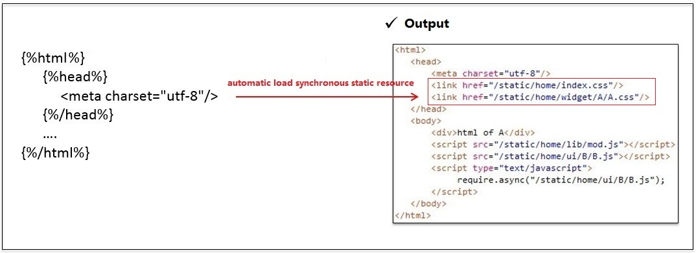
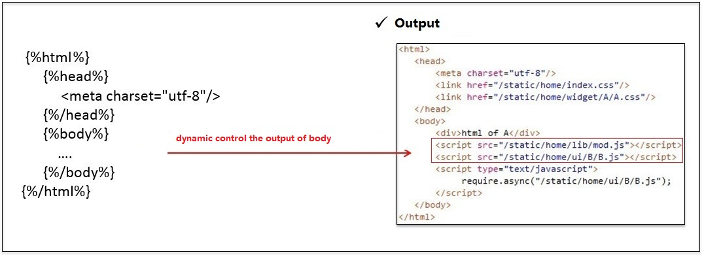
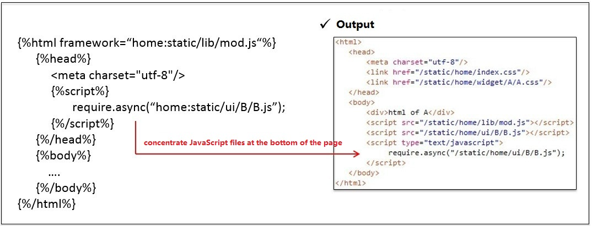
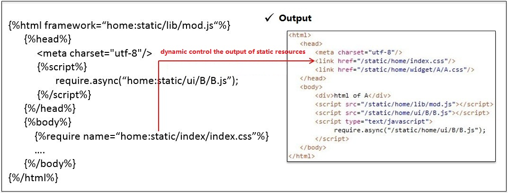
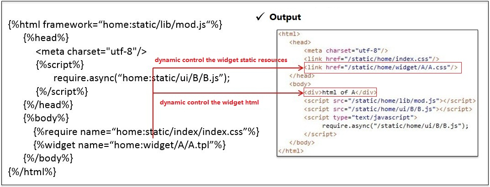

##Pages and Layout Based On Smarty

We provide a framework based on Smarty3/PHP for template, there are alse other back-end solutions coming soon, like java, go, etc. The framework provide some smarty html tag for use so we can efficiently control the loading of static resources. 

####

The smarty html tag is used to dynamic control the output of page, usage:

```

  ....


```

####

The smarty head tag is used to dynamic control the output of head, so we can automatic load synchronous static resource.



####

The smarty body tag is used to dynamic control the output of body.



####

The smarty body tag is used to dynamic control the output of script,  so we can automatic concentrate JavaScript files at the bottom of the page.



####

The smarty require tag is used to dynamic control the output of static resources, usage:



####

The smarty widget tag is used to dynamic control the output of widget static resources and html, usage:



You can find more in [How to Develop With Widgets](./doc/widget.md); 

###layout and page demo

layout.tpl from common subsystem:

```
<!DOCTYPE html>

    
    <meta charset="utf-8"/>
        <meta content="" name="description">
        <title></title>
        
    
    
    
    

```

index.tpl from ordinary subsystem:

```



    <!--[if lt IE 9]>
        <script src="/lib/js/html5.js"></script>
    <![endif]-->
    
    
    
    


    <div id="wrapper">
        <div id="sidebar">
            
            
        </div>
        <div id="container">
        	
            
            
                
            
        </div>
    </div>
    
    
    
    	var _bdhmProtocol = (("https:" == document.location.protocol) ? " https://" : " http://");
		document.write(unescape("%3Cscript src='" + _bdhmProtocol + "hm.baidu.com/h.js%3F70b541fe48dd916f7163051b0ce5a0e3' type='text/javascript'%3E%3C/script%3E"));
	

```