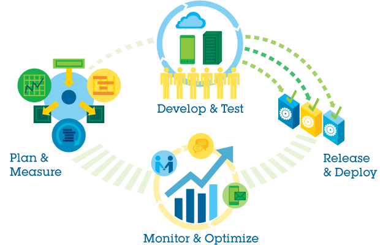
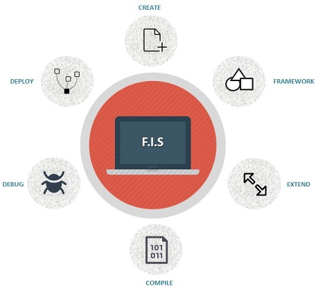

##What is FIS
Most of the teams which developing web sites or applications will experience plan&measure, develop&test, release&deploy, monitor&optimize, etc.

So, is there a way to simplify this process, so that the front-end team can quickly developing web sites and applications without worrying about framework and performance ?

The answer is yes!

By the end of 2011 at Baidu, we set up a team brings together elite engineers from various product R&D team, the team's task is to find the solutions to enhance the level of developer ergonomics. After much effort, we finally abstract a set of solutions from project development process, referred to as FIS(Front-end Integrated Solution).

FIS provides you with all the tools you need to iterate quickly, and adopt the best practices for your project. Build modern, maintainable web site without worrying about framework and performance.

Today, the solution has been applied to Baidu and other over 30 companies, enhances the front-end team's productivity, reduces it's development costs.